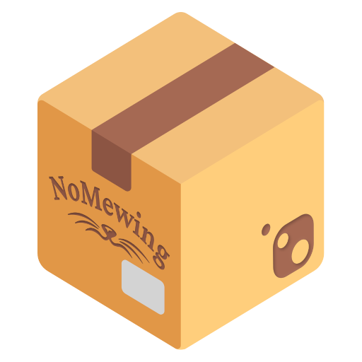

# MewGet

NuGet packages from NoMewing.

This repository contains multiple NuGet package projects published by NoMewing.
Each package has its own subproject, source code, and tests.

## Packages

- [NoMewing.SegoeFluentIcons](./NoMewing.SegoeFluentIcons/) - Provides strongly typed access to Segoe Fluent Icons.

## License

This repository is licensed under the [MIT License](./LICENSE).
